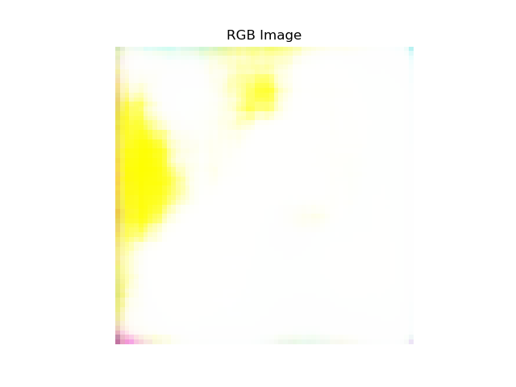
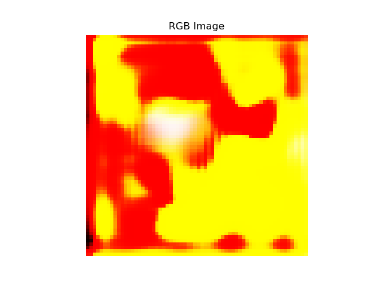
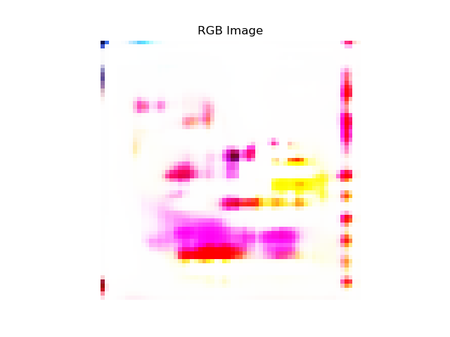
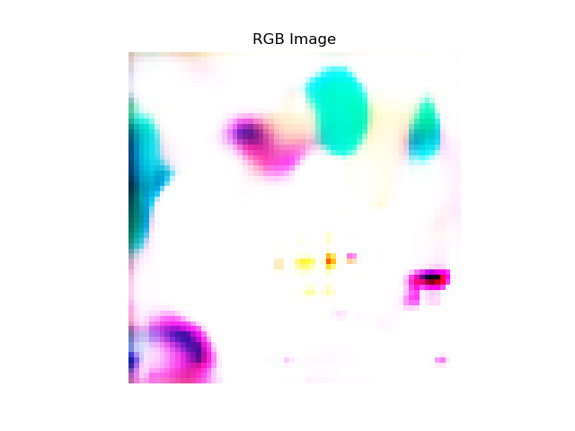
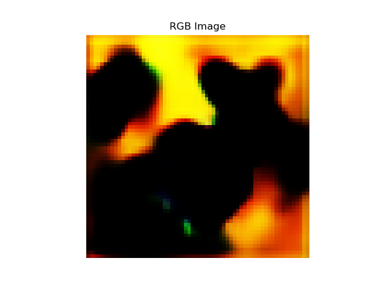

# Creating Anime Characters using a DCGAN

## Purpose
This project is an implementation of a Deep Convolutional Generative Adversarial Network, which is a an extension of the Generative Adversarial Network to allow for convolutional layers in both the generator and discriminator networks. I apply this to generate anime character faces such as those from the danbooru gallery.

## Usage

First, scrape anime images from danbooru using the `gallery-dl` package:
```
$ gallery-dl https://danbooru.donmai.us/posts?tags=face
```

Next, run the preprocessing script to detect faces and crop images to 64x64x3:
```
$ python preprocess.py
```

Finally, run the main script to train the model and record results into `results/`:
```
$ python run.py
```
## Samples of Images


## Results
We record the results for the model every 1000 epochs, retrieving images sampled from the generator.

After 0 epochs:



After 60 epochs:


After 70 epochs:



After 100 epochs:



After 440 epochs:


